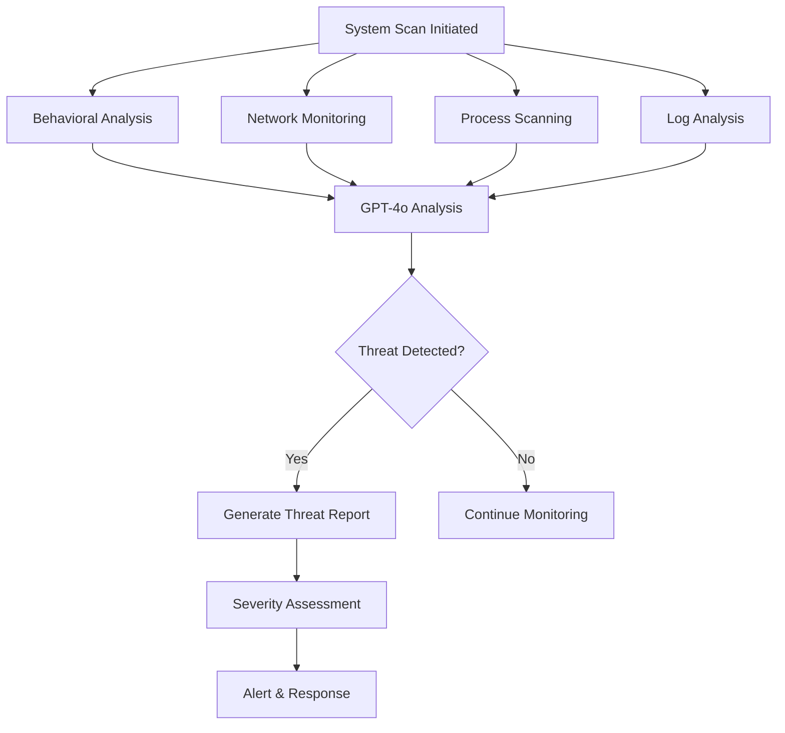

# AI Agent Detection Methods

This document details the various methods used to detect hostile AI agents in the system.

## Overview

The AI Defense System employs multiple detection vectors to identify rogue AI agents:

1. **Behavioral Analysis** - Pattern recognition using GPT-4o
2. **Network Traffic Analysis** - Monitoring connections to AI services
3. **Process Monitoring** - Detecting AI-related processes
4. **Log Analysis** - Scanning system logs for AI activity
5. **Memory Pattern Detection** - Identifying AI model artifacts

## Detection Strategies

### 1. Behavioral Analysis

The system uses GPT-4o to analyze system behavior patterns and identify anomalies that suggest AI agent activity:

- **Rapid API Calls**: Detecting unusually high frequencies of API calls to AI services
- **Suspicious Prompts**: Identifying jailbreak attempts or system prompt manipulations
- **Data Exfiltration**: Monitoring for attempts to export or transmit data
- **Model Downloads**: Detecting downloads of AI models from repositories

### 2. Network Traffic Analysis

Monitors network connections for communication with known AI services:

```python
# Known AI service endpoints monitored:
- api.openai.com (OpenAI GPT models)
- api.anthropic.com (Claude models)
- generativelanguage.googleapis.com (Google AI)
- huggingface.co (Model repository)
- replicate.com (Model hosting)
```

Detection criteria:
- Established connections to AI service IPs
- High-frequency API calls
- Large data transfers to/from AI services
- Unusual port usage patterns

### 3. Process Monitoring

Scans running processes for AI-related indicators:

**Process Name Patterns:**
- `python.*transformers` - Hugging Face transformers
- `python.*openai` - OpenAI SDK usage
- `python.*langchain` - LangChain framework
- `ollama` - Local LLM runner
- `llama.cpp` - CPU-based LLM inference
- `vllm` - Fast LLM serving

**Resource Usage Indicators:**
- High memory usage (>1GB) suggesting model loading
- Sustained high CPU usage
- GPU utilization patterns
- File handles to model files (.gguf, .safetensors, .bin)

### 4. Log Analysis

Examines system logs for AI agent fingerprints:

**Log Sources:**
- `/var/log/syslog` - System events
- `/var/log/auth.log` - Authentication attempts
- Web server logs - API access patterns
- Shell history - Command patterns

**Detection Patterns:**
- API endpoint access logs
- Model download activities
- Suspicious command sequences
- Authentication anomalies

### 5. Memory Pattern Detection

Advanced detection of AI models loaded in memory:

- Model weight patterns
- Tokenizer structures
- Attention mechanism signatures
- Embedding matrices

## Threat Scoring

Each detection is assigned a severity score (1-10):

- **1-3**: Low - Potential false positive, monitoring recommended
- **4-6**: Medium - Likely AI activity, investigation needed
- **7-8**: High - Confirmed AI agent, immediate action required
- **9-10**: Critical - Active hostile agent, emergency response

## GPT-4o Integration

The system leverages GPT-4o for intelligent analysis:

1. **Pattern Recognition**: Identifies complex behavioral patterns
2. **Anomaly Detection**: Spots deviations from normal system behavior
3. **Correlation Analysis**: Links multiple indicators to confirm threats
4. **Threat Assessment**: Evaluates severity and potential impact

## Detection Workflow



## False Positive Mitigation

To reduce false positives:

1. **Multi-vector Confirmation**: Requires evidence from multiple detection methods
2. **Contextual Analysis**: GPT-4o considers system context
3. **Whitelist Management**: Known safe processes and connections
4. **Behavioral Baselines**: Learns normal system behavior over time

## Continuous Improvement

The detection system improves through:

- Machine learning on detection outcomes
- Regular pattern updates
- Community threat intelligence
- Feedback from confirmed detections

## Configuration

Detection sensitivity can be tuned in `config/defense_config.yaml`:

```yaml
detection:
  behavioral:
    api_call_threshold: 100  # Adjust based on environment
    memory_threshold_gb: 2
    cpu_threshold_percent: 70
```

## Future Enhancements

Planned improvements:

1. **Kernel-level Detection**: Deep system monitoring
2. **ML Model Fingerprinting**: Identify specific model architectures
3. **Distributed Detection**: Multi-host correlation
4. **Real-time Stream Analysis**: Continuous monitoring
5. **Quantum-resistant Patterns**: Future-proof detection methods 